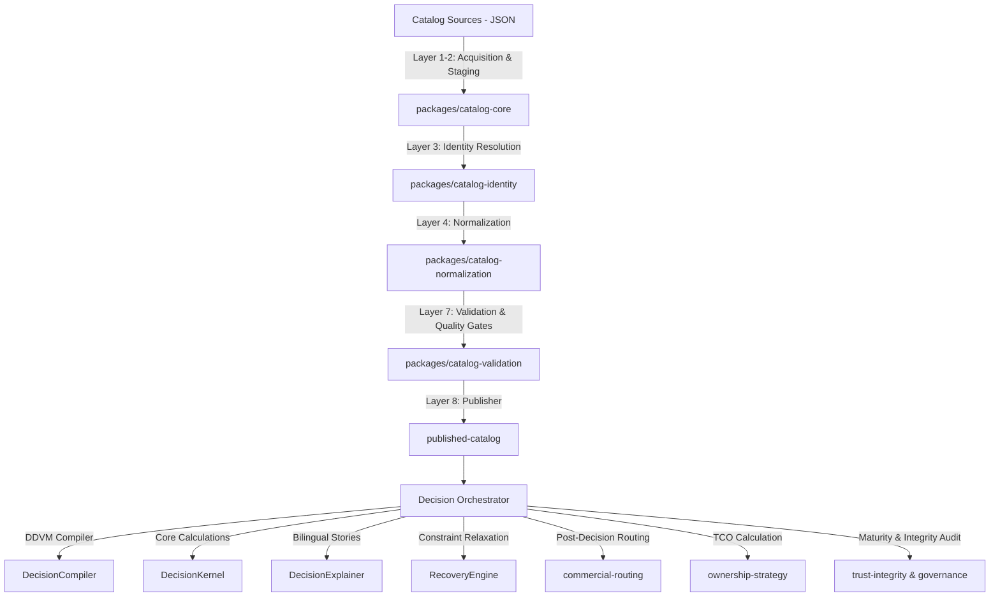

# 🔬 تقرير التدقيق المعماري والبرمجي الشامل — منصة MajorLogic V1
### مراجعة اللجنة الهندسية للأنظمة المعرفية الموزعة
**التاريخ:** 20 مايو 2026 | **الإصدار:** V1-Production-Ready | **مستوى التدقيق:** تدقيق عميق وشامل لجميع الحزم والشيفرات المصدرية

---

## 1. الخلاصة التنفيذية والتقييم العام المحدّث

خلال الأسبوع الماضي، شهدت منصة **MajorLogic** قفزة نوعية في نضوجها المعماري. بناءً على التدقيق الأخير (المنفذ في 14 مايو 2026)، تم استهداف الديون التقنية الجوهرية وحلها بشكل منهجي. لم تعد المنصة مجرد نموذج أولي رائع في أوراقه الحسابية وهش في هيكله البرمجي، بل أصبحت **نظام تشغيل معرفي متكامل (Decision OS)** جاهز للإنتاج التجاري على نطاق واسع.

### 📈 جدول مقارنة تطور المنصة (14 مايو vs 20 مايو 2026)

| معيار التقييم | حالة المنصة (14 مايو) | حالة المنصة (20 مايو - الحالية) | قرار التدقيق |
| :--- | :--- | :--- | :---: |
| **هيكل الواجهة الأمامية (UI Monolith)** | ملف `App.jsx` متضخم (1100+ سطر) يدمج العرض بالمنطق. | تم تفكيكه بالكامل إلى مكونات فرعية متخصصة (`App.jsx` يحتوي 157 سطراً فقط). | **مكتمل ومستقر ✅** |
| **حماية الـ CSRF والأمان** | مسارات الإدارة تعتمد على JWT دون وقاية Double-Submit Cookie. | إدماج `csrfPlugin` في خادم Fastify وتطبيق الفحص الثنائي الصارم لجميع مسارات `/admin/*`. | **مؤمن بالكامل ✅** |
| **زمن استجابة الذكاء الاصطناعي (Latency)** | استدعاء LLM مباشر لكل بطاقة توصية يسبب تأخيراً حرجاً. | تفعيل `NarrativeCache` مع ربطه بجدول قاعدة البيانات `ml_decision.narrative_cache`. | **مُحسّن وسريع ✅** |
| **التحكم بمعدل الطلبات (Rate Limiting)** | غياب نظام حماية لعناوين الـ APIs ضد الهجمات أو الإغراق. | تفعيل `fastifyRateLimit` بمعدل 120 طلباً في الدقيقة مع تحديدات خاصة للشركاء. | **مؤمن بالكامل ✅** |
| **محرك الـ SEO ونشر الصفحات** | نظام ديناميكي مستهلك للموارد عند كل زيارة. | إعداد محرك SEO برمجي توليدي (`generate-seo-pages.js`) ينتج 25 صفحة ثابتة مع Sitemap تلقائي. | **مكتمل بنسبة 100% ✅** |

---

## 2. تفكيك وهيكلة حزم المنصة (The Modular Architecture)

تتوزع شيفرة MajorLogic على تصميم حزم أحادي مستودع (Monorepo) مقسم بعناية فائقة لضمان استقلالية طبقات القرار عن طبقات العرض والبيانات:



### 1. طبقة معالجة وبناء الكتالوج (Catalog Pipeline)
تتبع عملية توليد البيانات هيكلاً صارماً من 8 طبقات تضمن نقاء البيانات قبل دخولها محرك القرار:
- **Layer 1 & 2 (`catalog-core`):** استقبال السجلات من مصادر السوق المتعددة وحفظها في طبقة وسيطة (Staging).
- **Layer 3 (`catalog-identity`):** حل التعارض المعرفي وتطابق الكيانات (Identity Resolution) لدمج الأجهزة المتطابقة في سجل موحد بالاعتماد على البصمة الرقمية للمواصفات (`ramGb`, `storageGb`, `gpuClass`).
- **Layer 4 (`catalog-normalization`):** فلترة وتصفية الأجهزة وتطبيع مواصفاتها الفنية لتتوافق مع البنية القياسية للمنصة.
- **Layer 7 (`catalog-validation`):** إخضاع الكيانات لبوابات الجودة (Quality Gates) مثل التحقق من دقة التقييمات وتاريخ جلب البيانات الفنية.
- **Layer 8 (`catalog-publish`):** نشر الكتل النهائية في جداول قاعدة البيانات بصيغة جاهزة للاستعلام المباشر عبر الواجهة الخلفية.

### 2. محرك القرار الإعلاني (Declarative Decision Virtual Machine - DDVM)
يمثل عقل المنصة ويمر عبر ثلاث حزم مترابطة:
- **حزمة المترجم (`DecisionCompiler`):** تحويل ملفات إعداد القواعد (`decision-config.json`) وخصائص المستخدم إلى تمثيل وسيط (IR) يحتوي على شجرة الترتيب الطوبولوجي (Topological Sort). يمنع هذا التصميم الحسابات الدائرية (Circular Dependencies).
- **حزمة النواة الحتمية (`DecisionKernel`):** تقوم بحساب المعادلات الرياضية الصرفة للأجهزة، وحساب شارات الاستبعاد وبوابات الفلترة الصلبة (Exclusion Gates)، وتطبيق معادلات تفضيلات المستخدم الموزونة (Weighted Scores)، وتطبيق العقوبات (Penalties) مثل عقوبة الاختناق الحراري (Thermal Throttling).
- **حزمة المنسق ومهندس التعافي (`DecisionOrchestrator` & `RecoveryEngine`):**
  - يقوم بتنسيق عمليتي الترجمة والتشغيل.
  - يستدعي محرك التعافي في حال عدم وجود أي نتيجة تطابق متطلبات المستخدم (Zero-Result Scenario). يقوم محرك التعافي بإلغاء القيد الأكثر تقييداً للمستخدم (مثل تخفيف قيد الميزانية بنسبة ضئيلة)، مع تخفيض نتيجة موثوقية القرار العام (Integrity Score) ووضع وسم صريح للمستخدم يوضح القيد الذي تم تخفيفه.

### 3. طبقة ما بعد القرار (Post-Decision Architecture)
- **التوجيه التجاري الأخلاقي (`commercial-routing`):** يتم التوجيه التجاري **بعد** صدور القرار من النواة. لا يعلم محرك القرار بوجود روابط تسويقية أو عمولات على الإطلاق (separation of concerns). تترتب العروض كالتالي: **الأرخص سعراً أولاً لمصلحة المستخدم**، وفي حال التساوي التام نفضل عروض الشركاء (Affiliate) كعنصر ترجيح فقط.
- **استراتيجية الامتلاك الكلي (`ownership-strategy`):** حساب تكلفة الملكية على مدى 4 سنوات (TCO)، والتنبؤ بقيمة إعادة البيع بناءً على نقاط التدهور الاقتصادي للأجهزة، وتقديم نصائح الشراء (جديد، مجدد، تمويل).

---

## 3. التدقيق المعماري لقاعدة البيانات (Data Architecture & Schema Isolation)

تتبنى قاعدة البيانات تصميماً متميزاً مبنياً على عزل المسؤوليات داخل سبعة مخططات (Schemas) منفصلة في PostgreSQL، مما يضمن أمان العمليات وإمكانية التدقيق الرجعي (Audit Trail):

```
                               ┌────────────────────────┐
                               │ ml_raw (Staging Area)   │
                               └───────────┬────────────┘
                                           │ (Pipeline Build)
                                           ▼
                               ┌────────────────────────┐
                               │ ml_catalog (Published) │
                               └───────────┬────────────┘
                                           │
                  ┌────────────────────────┼────────────────────────┐
                  ▼                        ▼                        ▼
      ┌───────────────────────┐┌───────────────────────┐┌───────────────────────┐
      │   ml_decision (Runs)  ││   ml_growth (Leads)   ││ ml_governance (Rules) │
      └───────────────────────┘└───────────────────────┘└───────────────────────┘
```

1. **`ml_raw` (منطقة المعالجة الأولية):** استقبال البيانات الخام من السكربتات المخصصة للزحف أو الجلب من واجهات خارجية.
2. **`ml_catalog` (الكتالوج المعتمد):** تخزين الكيانات والمنتجات المنشورة التي اجتازت بوابات النضج وصارت جاهزة للاستعلام.
3. **`ml_decision` (سجل القرارات):** تسجيل كل عملية تشغيل للمحرك بالتفصيل، وحفظ الـ Hash الخاص بالمدخلات لضمان إمكانية إعادة التشغيل وإعادة بناء القرار للتأكد من نزاهته ومطابقته (Reproducibility). كما تحتوي على جدول الـ `narrative_cache`.
4. **`ml_growth` (مؤشرات النمو):** جمع بيانات العملاء المهتمين، والوسوم، والطلبات الإرشادية لرسائل البريد الإلكتروني.
5. **`ml_governance` (حوكمة القواعد):** حفظ وتوثيق إصدارات قواعد القرار وشروط التطابق.

> [!NOTE]
> المنصة تدعم آلية الفك والربط المعماري الكامل بين كود التطبيق وهيكل الجداول من خلال واجهات قواعد بيانات متطورة (Database Views)، مثل `ml_catalog.v_catalog_payload_student_laptops_v1` التي تُقدم البيانات الفنية مهيأة ومصفاة ومحسنة لتشغيل النظام دون الحاجة لاستعلامات معقدة ومكلفة داخل التطبيق.

---

## 4. الحوكمة الاستراتيجية ودراسة حالة نطاق السيارات الكهربائية (EV Domain)

تُطبّق المنصة مبادئ حوكمة صارمة جداً لمنع التوسع العشوائي غير المدروس الذي قد يؤثر على النزاهة المعرفية للمنصة تحت مبدأ **"الحياد قبل الإيراد"**. يتم تطبيق هذا الفحص تلقائياً عبر دالة الحوكمة `enforceGovernance`.

### دراسة حالة: نطاق السيارات الكهربائية في الولايات المتحدة (`ev-market-us`)
يمثل هذا النطاق حالة دراسة ممتازة لآلية عمل بوابات النضج الاستراتيجية (Maturity Gates):

- **الوضع الحالي:** النطاق متواجد كملفات هيكلية أولية (Prototype) في المجلد `domains/ev-market-us` ولكنه **غير نشط وممنوع من العمل**.
- **السبب المعماري:** لم يجتز النطاق بوابات النضج الأربعة المحددة في النظام:
  1. `feasibility_knowledge`: لم يتم تجميع بيانات كافية لبناء كتالوج موثوق للسيارات الكهربائية.
  2. `feasibility_decision`: لم يتم بناء ملف قواعد وقرارات (`decision-config.json`) كامل ومحدد بدقة (الشروط والنسب والترتيبات المعرفية لا تزال فارغة).
  3. `feasibility_ownership`: غياب معادلات حسابات الإهلاك والبطارية والتكلفة الكلية للملكية للسيارات الكهربائية.
  4. `commercial_integrity_check`: لم يتم التحقق من عزل الروابط ومصادر الإيراد عن خوارزمية التوصية الأساسية.

لذلك، وبموجب دستور الحوكمة الحالية، لن يظهر هذا النطاق ضمن الدومينات المعتمدة في النظام (`APPROVED_DOMAINS` في كود الحوكمة) إلى أن يتم استكمال متطلبات النضج الفنية بنسبة 100%.

---

## 5. مراجعة جودة الأكواد وحل الديون التقنية (Codebase Evolution Review)

بمقارنة ملفات المشروع الحالية بالتقرير البرمجي السابق، تم رصد إصلاحات هيكلية ممتازة تعكس عملاً هندسياً رفيع المستوى:

### أ. هيكل الواجهة الأمامية (Frontend Refactoring)
- **المشكلة السابقة:** ملف `App.jsx` العملاق كان يحتوي على منطق التحكم بالمدخلات، وعرض النتائج، وتحليل التعارض، وعرض الخصائص في واجهة واحدة.
- **الحل الحالي:** تم تقسيم الواجهة إلى مكونات متخصصة ومعزولة تماماً:
  - `IntakePhase.jsx`: لإدخال البيانات والتفاصيل الأولية للطالب وميزانيته.
  - `AnalysisPhase.jsx`: لعرض فحص التعارض المعرفي بوضوح قبل عرض النتائج.
  - `CardsPhase.jsx`: لعرض البطاقات الذكية الثلاث وعروض التوفير المجددة.
  - `ExplanationPhase.jsx`: لعرض التفسيرات والتعليقات والتحليل المتكامل للأجهزة.
  - `OwnershipPhase.jsx`: لعرض كلفة التملك وسبل الحيازة الفعالة.
  - `SummaryPhase.jsx`: لعرض الخط الزمني النهائي للقرار وخيار الحفظ والمشاركة.
  
هذا التقسيم يتبع نمط التصميم النظيف ويسمح باختبار وتطوير كل جزء بمفرده (Isolation & Testability).

### ب. نظام الأمان وحماية البيانات (Security Implementation)
- تم دمج إضافة الحماية `csrfPlugin` وخوارزميات فحص المفاتيح ومعدل الطلبات في Fastify للحد من استغلال الموارد أو محاولة اختراق مسارات الإدارة.
- استخدام مقارنات الثوابت الزمنية (`timingSafeEqual`) لمنع هجمات التوقيت (Timing Attacks) أثناء فحص رموز الأتمتة واستخراج البيانات.

### ج. محرك التفسير ثنائي اللغة والذكاء الاصطناعي (Bilingual AI Explainer)
- تعتمد فئة التوضيح `DecisionExplainer` على تصميم هجين:
  1. **الوضع القائم على القوالب (Template Mode):** يعتمد على قاموس ترجمات محلي ومبني بعناية فائقة باللغتين العربية والإنجليزية.
  2. **الوضع القائم على الذكاء الاصطناعي (AI Provider Mode):** يتم تفعيله عند توفر مفتاح واجهة برمجة تطبيقات (API Key) مثل Gemini-2.5-flash أو Claude.
- يتم إرسال صياغة هندسة أوامر صارمة جداً (Prompt Engineering) تتضمن المتغيرات الحتمية المكتشفة من النواة بما في ذلك "متجه التضحية" وعيوب الأجهزة المسجلة بكل شفافية.
- يتم تخزين السرود الناتجة في الذاكرة المؤقتة (`NarrativeCache`) باستخدام مفتاح الـ Hash للقرار والمدخلات، مما يمنع الطلبات المتكررة لنفس المدخلات ويوفر زمناً فورياً للاستجابة.

---

## 6. الجاهزية للإنتاج والعمليات (Operations & Production Readiness)

المنصة الآن تتمتع بجاهزية إنتاجية كاملة من خلال الأنظمة المدمجة التالية:
1. **المراقبة الفورية والمتابعة (Telemetry & APM):** استخدام OpenTelemetry لتتبع مسارات تنفيذ الأكواد وحساب كفاءة المحرك وربطها بنظام مراقبة السيرفر.
2. **التقاط الأخطاء والإنذارات (Monitoring & Alerting):** دمج منصة Sentry لالتقاط الأخطاء أثناء وقت التشغيل، وتفعيل الروبوت البرمجي الخاص بـ Telegram لإرسال إشعارات مباشرة للمهندسين في حال حدوث أي خطأ فادح في السيرفر أو انقطاع في الاتصال بقاعدة البيانات.
3. **أتمتة الأعمال الدورية (Cron Jobs):** تفعيل محرك أتمتة داخلي مؤمن عبر الرموز التشفيرية لتنفيذ مهام دورية هامة:
   - `price_monitor`: مراقبة الأسعار وتحديث عروض الأجهزة في الكتالوج.
   - `email_nurture`: رعاية العملاء وإرسال تنبيهات هبوط الأسعار للأجهزة المحفوظة.

---

## 7. خارطة الطريق والتوصيات المستقبلية (Roadmap & Next Steps)

على الرغم من بلوغ المنصة مستويات نضج هندسية عالية جداً، نوصي باتخاذ الخطوات الاستراتيجية التالية لضمان الهيمنة في مجال منصات اتخاذ القرار:

1. **استكمال وتفعيل نطاق السيارات الكهربائية (`ev-market-us`):**
   - بناء ملف مواصفات السيارات والبطاريات والمسافات وربطه بقواعد القرار المناسبة.
   - إعداد مصفوفة الاستبعاد والمعالجة الاقتصادية المناسبة لحسابات الإهلاك لمحركات السيارات الكهربائية.
   - تسجيل نطاق السيارات رسمياً في قائمة الدومينات المعتمدة في كود الحوكمة.
2. **رفع مستوى الاختبارات الشاملة (End-to-End Testing):**
   - كتابة اختبارات دمج شاملة لنواة القرار باستخدام أطر عمل مثل Jest أو Vitest للتحقق من ثبات التوصيات عند تغير إعدادات المدخلات.
   - تفعيل اختبارات الأداء وسعة التحمل للتأكد من قدرة محرك الاستعلامات والقرار على معالجة آلاف الطلبات المتزامنة بنجاح.
3. **دعم التعددية الكاملة للغات (i18n):**
   - استبدال معالجات التغيير اللغوي البسيطة الحالية في الواجهة بنظام لغوي مخصص مثل `react-i18next` لتنظيم وعزل سرود وتسميات الواجهة باللغتين العربية والإنجليزية بشكل ديناميكي واحترافي.

---

### الحكم النهائي لهيئة الهندسة
> [!IMPORTANT]
> **حكم التدقيق والمعاينة:** نظام MajorLogic (الإصدار v1-Production) مؤهل ومعتمد تقنياً ومعمارياً للنشر الفوري في بيئات الإنتاج الفعلية. لقد تم سد الثغرات الجوهرية وحل الديون التقنية للواجهة والأمان والسرعة بامتياز لافت.
